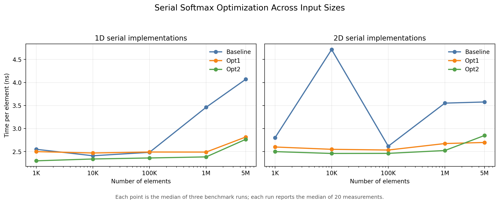
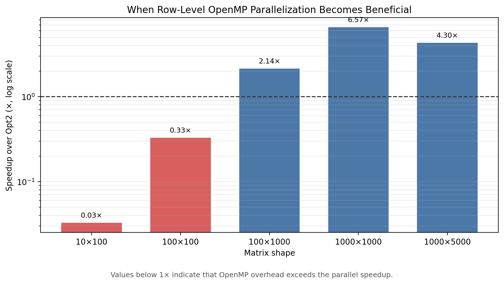
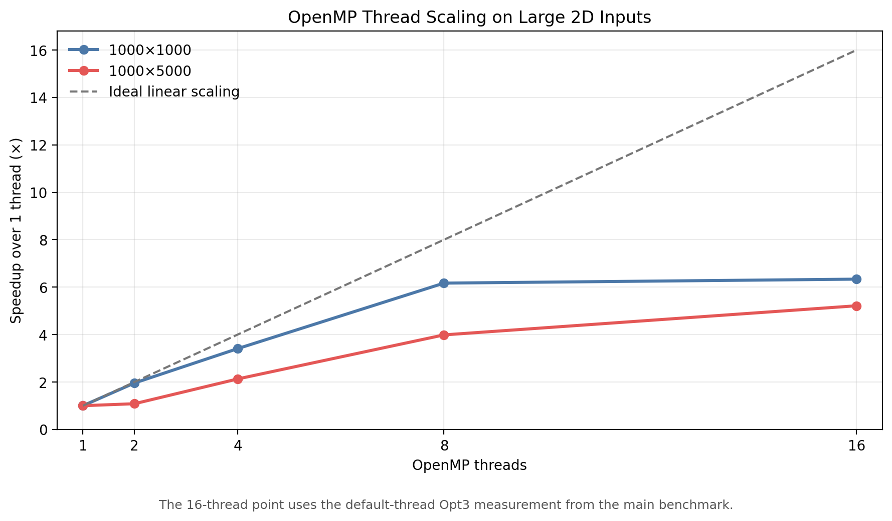

# C++ Softmax 算子实现

这是一个面向 AI Infra 入门的 CPU Softmax 算子实践项目。

项目使用 C++17 实现数值稳定的1D和2D FP32 Softmax，并建立了从工程构建、Python参考验证、CTest自动化测试，到串行优化、OpenMP并行化、性能测试、数据汇总和图表展示的完整流程。

本项目的重点不只是实现Softmax公式，而是完成一个可以编译、测试、验证、优化、复现和分析的完整C++工程项目。

| 项目时间 | 日期 |
|---|---|
| 项目开始时间 | 2026年8月1日 |
| 第一版目标日期 | 2026年8月14日 |
| 第一版实际完成日期 | **2026年8月14日** |
| 当前状态 | **第一阶段全部完成** |

> 第一阶段已于2026年8月14日按原定计划完成。基础实现、正确性测试、三轮CPU优化、正式性能实验、CSV结果整理、图表生成和复现文档均已完成。

## 项目目标与完成情况

- [x] 使用C++实现基础Softmax
- [x] 通过减去输入最大值保证数值稳定性
- [x] 支持1D FP32输入
- [x] 支持按行计算的2D FP32输入
- [x] 使用Python和SciPy验证计算结果
- [x] 覆盖随机输入、数值稳定性和边界情况
- [x] 使用CMake和CTest管理构建与测试
- [x] 建立Release性能测试
- [x] 实现输出缓冲复用优化
- [x] 实现倒数乘法优化
- [x] 实现OpenMP行级并行优化
- [x] 测试不同输入规模和线程数量
- [x] 完成三次正式benchmark运行
- [x] 将原始TXT转换为结构化CSV
- [x] 生成性能结果汇总与图表
- [x] 完成正确性、性能和环境复现文档

## Softmax计算

Softmax的基本公式为：

$$
y_i = \frac{e^{x_i}}{\sum_j e^{x_j}}
$$

直接计算指数可能发生数值溢出，因此实际实现先减去输入中的最大值：

$$
y_i =
\frac{e^{x_i-\max(x)}}
{\sum_j e^{x_j-\max(x)}}
$$

这一变换不会改变Softmax结果，但能够显著提高大数输入下的数值稳定性。

对于2D输入，本项目以扁平化的`row × col`数组保存矩阵，并对每一行独立计算Softmax。

## 实现与优化路线

| 实现 | 适用范围 | 核心方法 |
|---|---|---|
| Baseline | 1D、2D | 数值稳定Softmax，返回新输出数组 |
| Opt1 | 1D、2D | 由调用方提供并复用输出缓冲，减少重复内存分配和结果传递 |
| Opt2 | 1D、2D | 预先计算归一化分母的倒数，以乘法替代逐元素除法 |
| Opt3 | 2D | 使用OpenMP对矩阵行进行并行计算 |

优化按照可解释的小步骤逐步加入，并分别进行正确性验证和性能比较。

Opt1主要针对内存分配和输出传递开销；Opt2针对归一化阶段的重复除法；Opt3则利用2D Softmax各行相互独立的特点进行CPU多线程并行。

## 项目结构

```text
cpp-softmax-operator/
├── CMakeLists.txt
├── README.md
├── ENVIRONMENT.md
├── requirements.txt
├── LICENSE
├── include/
│   └── softmax.h
├── src/
│   ├── main.cpp
│   └── softmax.cpp
├── tests/
│   ├── test_driver.cpp
│   ├── test_optimization.cpp
│   ├── test_softmax_1d.py
│   ├── test_softmax_2d.py
│   └── results/
│       ├── correctness_final.txt
│       └── correctness_summary.md
└── benchmarks/
    ├── benchmark_softmax.cpp
    ├── parse_results.py
    ├── plots/
    │   ├── serial_optimization.png
    │   ├── openmp_crossover.png
    │   └── openmp_scaling.png
    └── results/
        ├── raw/
        │   ├── final_run_01.txt
        │   ├── final_run_02.txt
        │   └── final_run_03.txt
        ├── benchmark_results.csv
        ├── benchmark_summary.csv
        └── benchmark_summary.md
```

## 环境要求

最终结果使用以下主要环境生成：

- Windows 11 64位
- AMD Ryzen 7 7435H
- 8个物理核心，16个逻辑处理器
- C++17
- MSYS2 UCRT64
- g++ 16.1.0
- CMake 4.4.0
- Ninja
- OpenMP
- Python 3.12.10
- NumPy 2.4.6
- SciPy 1.17.1
- Matplotlib 3.10.9

完整环境、构建配置和实验方法见：

- [`ENVIRONMENT.md`](ENVIRONMENT.md)
- [`requirements.txt`](requirements.txt)

## 构建与运行

以下命令均在项目根目录执行。

### 安装Python依赖

```powershell
python -m pip install -r requirements.txt
```

### 构建功能测试版本

```powershell
cmake -S . -B build -G Ninja
cmake --build build
```

运行示例程序：

```powershell
.\build\softmax_demo.exe
```

### 运行正确性测试

```powershell
ctest --test-dir build -V
```

### 构建Release性能版本

```powershell
cmake -S . -B build-release -G Ninja -DCMAKE_BUILD_TYPE=Release
cmake --build build-release
```

运行性能测试：

```powershell
.\build-release\softmax_benchmark.exe
```

正确性测试使用普通`build`目录，正式性能数据使用`build-release`目录。

## 正确性验证

Baseline实现通过Python和SciPy进行逐元素比较，优化实现则与对应的Baseline结果比较。

统一误差指标为最大绝对误差，允许误差为`1e-5`。

| 验证对象 | 参考结果 | 测试场景数 | 最大绝对误差 | 结果 |
|---|---|---:|---:|---|
| 1D和2D Baseline | SciPy | 9 | 2.9802322387695312e-08 | 通过 |
| Opt1、Opt2和Opt3 | Baseline | 5 | 1.49012e-08 | 通过 |
| 全部测试 | SciPy或Baseline | 14 | 2.9802322387695312e-08 | **全部通过** |

最终CTest结果：

```text
3/3 tests passed
100% tests passed
CTest exit code = 0
```

最大观测误差约为允许误差的0.3%，比`1e-5`阈值小约336倍。

测试覆盖：

- 1D随机输入；
- 大数值稳定性输入；
- 单元素和全相同元素；
- 2D按行Softmax；
- 通过转置验证的按列Softmax；
- `1 × 1`矩阵；
- 全相同元素矩阵；
- 单列矩阵；
- Opt1、Opt2和Opt3优化实现。

完整结果见：

- [`correctness_summary.md`](tests/results/correctness_summary.md)
- [`correctness_final.txt`](tests/results/correctness_final.txt)

## 性能实验方法

最终benchmark采用以下统一设置：

| 项目 | 设置 |
|---|---|
| 构建模式 | Release |
| 固定随机种子 | `20260814` |
| 输入类型 | FP32 |
| 输入分布 | Uniform(-10.0, 10.0) |
| 每组预热次数 | 5 |
| 每组计时次数 | 20 |
| 单次运行统计量 | 中位数 |
| 完整运行次数 | 3 |
| 最终统计量 | 三次运行中位数的中位数 |

1D输入规模为：

```text
1,000
10,000
100,000
1,000,000
5,000,000
```

2D矩阵规模为：

```text
10 × 100
100 × 100
100 × 1,000
1,000 × 1,000
1,000 × 5,000
```

三次正式运行分别保存在：

```text
benchmarks/results/raw/final_run_01.txt
benchmarks/results/raw/final_run_02.txt
benchmarks/results/raw/final_run_03.txt
```

三次运行共生成165行结构化明细数据，最终汇总为55行统计结果。

## 关键性能结果

下表使用三次正式运行的最终中位数。加速比均相对于相同输入规模下的Baseline。

| 输入规模 | Baseline时间 | 最佳实现 | 最佳时间 | 相对Baseline加速比 |
|---|---:|---|---:|---:|
| 1D，1,000,000元素 | 3.46235 ms | Opt2 | 2.38515 ms | 1.45× |
| 1D，5,000,000元素 | 20.34730 ms | Opt2 | 13.83170 ms | 1.47× |
| 2D，100 × 100 | 0.04715 ms | Opt2 | 0.02460 ms | 1.92× |
| 2D，100 × 1,000 | 0.26170 ms | Opt3 | 0.11490 ms | 2.28× |
| 2D，1,000 × 1,000 | 3.55240 ms | Opt3 | 0.38435 ms | 9.24× |
| 2D，1,000 × 5,000 | 17.88590 ms | Opt3 | 3.31565 ms | 5.39× |

完整性能结果见：

- [`benchmark_summary.md`](benchmarks/results/benchmark_summary.md)
- [`benchmark_summary.csv`](benchmarks/results/benchmark_summary.csv)
- [`benchmark_results.csv`](benchmarks/results/benchmark_results.csv)

## 性能图表

### 串行优化结果



Opt1和Opt2在小规模输入上的差异较小；随着输入规模增大，输出缓冲复用和倒数乘法的收益逐渐稳定。1D Opt2在100万和500万元素上分别达到约1.45倍和1.47倍加速。

### OpenMP收益转折点



小矩阵的计算量不足以抵消线程创建、调度和同步开销，因此Opt3在`10 × 100`和`100 × 100`上慢于串行实现。

在本次实验范围内，并行收益转折点出现在`100 × 100`与`100 × 1,000`之间。从`100 × 1,000`开始，OpenMP行级并行成为最快实现。

### OpenMP线程缩放



`1,000 × 1,000`输入从1线程增加到8线程时具有较好的缩放效果，但从8线程增加到16线程后收益接近饱和。

`1,000 × 5,000`在16线程下仍有额外收益，但整体加速低于理想线性缩放，说明性能同时受到线程管理、内存访问和硬件并行能力限制。

## 主要结论

1. 数值稳定的Baseline实现通过了SciPy参考验证以及全部边界测试。

2. Opt1和Opt2没有破坏正确性，其数值差异保持在`1e-8`量级以内。

3. 输出缓冲复用和倒数乘法对小输入的收益有限，但能够稳定改善大规模1D和2D串行Softmax性能。

4. OpenMP行级并行存在明显的输入规模门槛。小矩阵上的并行开销大于收益，大矩阵才适合多线程计算。

5. 本次实验中的最高Baseline加速比为9.24倍，出现在`1,000 × 1,000`矩阵的16线程Opt3实现中。

6. OpenMP线程缩放不是理想线性的。物理核心数量、逻辑线程、内存访问和系统调度都会影响最终结果。

7. 性能结论来自同一硬件、同一Release构建和同一固定输入下的相对比较，不将绝对时间解释为适用于所有平台的通用结果。

## 结果与复现文件

| 文件 | 用途 |
|---|---|
| [`ENVIRONMENT.md`](ENVIRONMENT.md) | 完整硬件、软件、构建和实验环境 |
| [`requirements.txt`](requirements.txt) | Python依赖版本 |
| [`correctness_summary.md`](tests/results/correctness_summary.md) | 正确性结果汇总 |
| [`correctness_final.txt`](tests/results/correctness_final.txt) | CTest原始日志 |
| [`benchmark_summary.md`](benchmarks/results/benchmark_summary.md) | 性能结果汇总与结论 |
| [`benchmark_summary.csv`](benchmarks/results/benchmark_summary.csv) | 三次运行的最终统计数据 |
| [`benchmark_results.csv`](benchmarks/results/benchmark_results.csv) | 三次运行的结构化明细 |
| `benchmarks/results/raw/` | 三次正式benchmark原始输出 |
| `benchmarks/plots/` | 三张最终性能图 |

## 开发时间线

| 时间 | 完成内容 |
|---|---|
| 2026年8月1日 | 建立项目范围，创建C++和CMake基础工程 |
| 2026年8月1日—8月6日 | 完成数值稳定的1D、2D Softmax以及Python/CTest正确性验证 |
| 2026年8月6日—8月10日 | 建立Baseline性能测试并完成Opt1输出缓冲复用 |
| 2026年8月10日—8月11日 | 完成Opt2倒数乘法和Opt3 OpenMP行级并行 |
| 2026年8月12日—8月14日 | 固定实验方法，完成三次正式运行、CSV汇总、图表和复现文档 |
| **2026年8月14日** | **第一阶段全部内容按计划完成** |

项目从2026年8月1日开始，在2026年8月14日完成第一阶段，实际完成日期与最初目标日期一致。

## 项目范围

为了保持第一阶段目标明确，本项目聚焦于CPU上的FP32 Softmax实现与优化，不包括：

- CUDA；
- Ascend C；
- GPU或NPU算子开发；
- 分布式计算；
- 深度学习框架底层集成；
- 其他复杂AI算子。

这些内容属于后续可能的扩展方向，不影响当前第一阶段作为完整独立项目的完成状态。

## 许可证

本项目使用MIT License。